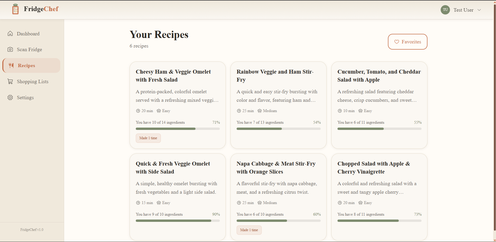

#  FridgeChef

<div align="center">


### **The Intelligent Kitchen Operating System**
**Turn your fridge into a five-star pantry with the power of generative AI.**

[Explore the Platform](https://fridgechef.vercel.app) • [View API Docs](http://localhost:8000/docs) • [Implementation Plan](IMPLEMENTATION_PLAN.md)

</div>

---

##  The Vision

FridgeChef bridges the gap between available ingredients and culinary inspiration. Using cutting-edge computer vision and generative AI, it acts as a digital sous-chef that understands your kitchen inventory, dietary preferences, and cooking goals. By automating ingredient recognition and recipe engineering, the platform reduces food waste and simplifies daily meal planning.

---

##  Platform Interface

### **Intelligent Dashboard**
The central command center for tracking recent scans, browsing personalized recipe suggestions, and managing kitchen inventory at a glance.

<div align="center">
  
</div>

<br />

### **AI-Powered Scanning**
Snap a photo of your fridge or pantry. The Groq-powered vision pipeline identifies ingredients, estimates quantities, and determines freshness instantly, eliminating the need for manual data entry.

<div align="center">
  
</div>

<br />

### **Recipe Discovery**
Browse recipes specifically matched to your current inventory. The AI understands flavor profiles and cooking techniques to provide the perfect meal based on what you already have.

<div align="center">
  
</div>

---

##  System Architecture

### **1. AI & Computer Vision Pipeline**
At the core of FridgeChef is **Groq-hosted Llama models**.
- **Ingredient Detection**: Images are processed via the FastAPI backend and sent to Groq with specialized multimodal prompts for identification and categorization.
- **Generative Recipe Logic**: Recipes are generated on-the-fly, considering inventory combinations, dietary restrictions, and difficulty levels.

### **2. Frontend Architecture**
- **Next.js 14 (App Router)**: Utilizing React Server Components and optimized routing.
- **React Query (TanStack)**: Manages server-state with automatic caching and background synchronization.
- **Zustand**: Handles lightweight client-side state for authentication and UI preferences.
- **PWA Integration**: Full Progressive Web App support for mobile installation and offline capabilities.

### **3. Backend Infrastructure**
- **FastAPI**: An asynchronous Python framework handling high-concurrency AI requests with minimal latency.
- **SQLAlchemy 2.0 & PostgreSQL**: Modern ORM patterns ensuring data integrity for user profiles, inventory, and saved recipes.
- **Security & Rate Limiting**: Integrated JWT authentication and SlowAPI rate limiting to protect infrastructure.

---

##  Core Capabilities

- **Computer Vision Analysis**: Automatic identification of ingredients from smartphone photos.
- **Generative Recipe Engineering**: Custom recipes optimized for specific inventory and user preferences.
- **Inventory Intelligence**: Real-time matching between recipes and digital pantry contents.
- **Smart Shopping Lists**: Automated generation of lists for missing ingredients.
- **Mobile-First Design**: Responsive PWA with smooth micro-interactions and high-performance UI.

---

##  Deployment & Setup

### **Quick Start (Docker)**
1. **Clone**: `git clone https://github.com/rithwik1510/FridgeChef.git`
2. **Environment**: `cp .env.example .env` and add your Groq API Key.
3. **Launch**: `docker-compose up -d`

### **Manual Installation**

**Backend Environment**
```bash
cd backend
python -m venv venv
# Windows: venv\Scripts\activate | Unix: source venv/bin/activate
pip install -r requirements.txt
uvicorn app.main:app --reload
```

**Frontend Environment**
```bash
cd frontend
npm install
npm run dev
```

---

##  Verification & Testing

FridgeChef includes comprehensive test suites to ensure system reliability and security.

**Backend Suite**
```bash
cd backend
pytest                    # Run all tests
pytest --cov              # Run with coverage report
ruff check .              # Linting
mypy .                    # Type checking
```

**Frontend Suite**
```bash
cd frontend
npm run test              # Run unit tests
npm run test:coverage     # Run with coverage report
npm run lint              # Run ESLint
```

---

##  Contributing

We welcome contributions to the FridgeChef ecosystem. Please refer to [CLAUDE.md](CLAUDE.md) for development guidelines and [IMPLEMENTATION_PLAN.md](IMPLEMENTATION_PLAN.md) for the project roadmap.

Distributed under the **MIT License**.

<div align="center">

### **Developed by Rithwik**
**Precision-engineered for the modern kitchen.**

</div>
