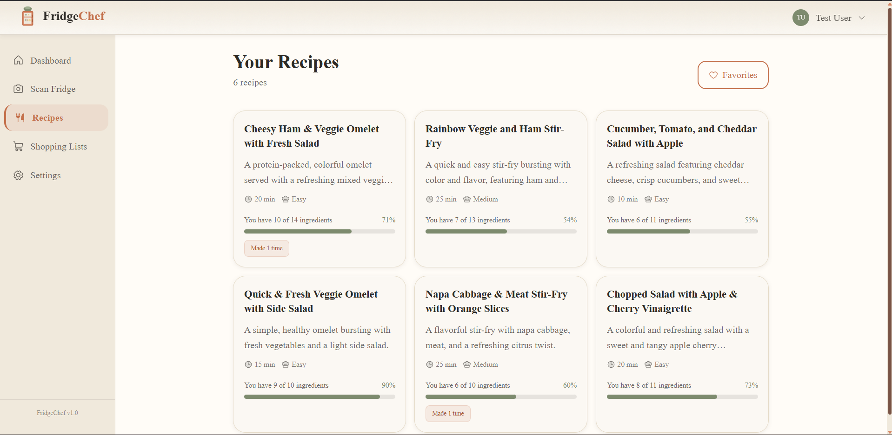

#  FridgeChef

<div align="center">


### **The Intelligent Kitchen Operating System.**
**Turn your fridge into a five-star pantry with the power of generative AI.**

[Explore the Platform](https://fridgechef.vercel.app) • [Read the Plan](IMPLEMENTATION_PLAN.md) • [View API Docs](http://localhost:8000/docs)

</div>

---

##  The Vision

Every year, millions of tons of food go to waste simply because we don't know what to cook with what we have. **FridgeChef** bridges the gap between available ingredients and culinary inspiration. Using cutting-edge computer vision and generative AI, it acts as a digital sous-chef that understands your kitchen, your preferences, and your schedule.

---

##  Experience the Interface

### **Intelligent Dashboard**
Your culinary command center. Track recent scans, browse personalized recipe suggestions, and manage your kitchen inventory at a glance.

<div align="center">
  
</div>

<br />

### **AI-Powered Fridge Scanning**
Forget manual entry. Snap a photo of your fridge or pantry, and our Gemini-powered vision pipeline identifies every ingredient, estimates quantities, and determines freshness instantly.

<div align="center">
  
</div>

<br />

### **Curated Culinary Discovery**
Browse recipes specifically matched to your current inventory. Our AI doesn't just match keywords; it understands flavor profiles, dietary restrictions, and cooking techniques to provide the perfect meal for your ingredients.

<div align="center">
  
</div>

---

##  How It's Built

FridgeChef is a full-stack application engineered with a focus on real-time performance and seamless AI integration.

### **1. AI & Computer Vision Pipeline**
At the heart of FridgeChef is the **Google Gemini 2.5 Flash** model. 
- **Ingredient Detection**: When you upload a photo, the image is processed through our FastAPI backend and sent to Gemini with a specialized multi-modal prompt. The AI identifies ingredients, suggests quantities, and categorizes them (Produce, Dairy, Meat, etc.).
- **Generative Recipe Logic**: Unlike traditional database-driven recipe apps, FridgeChef uses **Generative AI** to build recipes on-the-fly. It considers the combination of ingredients, user dietary preferences, and difficulty levels to "invent" recipes that minimize waste.

### **2. Frontend Architecture (The Kitchen)**
- **Next.js 14 (App Router)**: Utilizing the latest React features for optimized routing and server-side rendering.
- **React Query (TanStack)**: Used for robust server-state management, providing automatic caching, background fetching, and optimistic updates.
- **Zustand**: Handles local client state for authentication and UI preferences.
- **Design System**: A custom-tailored Tailwind CSS implementation featuring a "Kitchen Table" aesthetic—warm, organic colors (`Terracotta`, `Sage`, `Butter`) that make the app feel inviting.

### **3. Backend Infrastructure (The Line)**
- **FastAPI**: An asynchronous Python framework that handles high-concurrency AI requests with minimal latency.
- **SQLAlchemy 2.0 & PostgreSQL**: Modern ORM patterns ensure data integrity for user profiles, saved recipes, and pantry inventory.
- **SlowAPI**: Integrated rate-limiting to protect the generative AI infrastructure from abuse.
- **Request Logging Middleware**: Custom middleware for real-time observability and performance tracking.

---

##  Key Capabilities

- **📸 Computer Vision Analysis**: Automatically identifies ingredients from smartphone photos.
- **🍳 Generative Recipe Engineering**: Custom recipes generated using Gemini, optimized for your specific inventory.
- **📊 Inventory Intelligence**: Real-time matching between recipes and your digital pantry.
- **🛒 Smart Shopping Lists**: Automatic generation of lists for missing items.
- **🎨 Modern UX**: A responsive, mobile-first design with smooth micro-interactions.

---

##  Deployment & Installation

### **The 60-Second Start (Windows)**
1.  **Clone**: `git clone https://github.com/rithwik1510/FridgeChef.git`
2.  **Setup**: Run `FIRST_TIME_SETUP.bat` and provide your Gemini API Key.
3.  **Launch**: Run `START_APP.bat`.

### **Manual Installation**

**1. Backend Environment**
```bash
cd backend
python -m venv venv
venv\Scripts\activate
pip install -r requirements.txt
uvicorn app.main:app --reload
```

**2. Frontend Environment**
```bash
cd frontend
npm install
npm run dev
```

---

## Testing

FridgeChef includes comprehensive test suites for both frontend and backend.

### **Backend Tests**
```bash
cd backend
pytest                    # Run all tests
pytest --cov              # Run with coverage report
ruff check app/           # Run linting
mypy app/                 # Run type checking
```

### **Frontend Tests**
```bash
cd frontend
npm run test              # Run tests in watch mode
npm run test:run          # Run tests once
npm run test:coverage     # Run with coverage report
npm run lint              # Run ESLint
```

**Current Coverage**: Backend 78% | Frontend tests passing

---

##  Contributing & License

We welcome contributions to the FridgeChef ecosystem. Please see our [CLAUDE.md](CLAUDE.md) for development rules and [IMPLEMENTATION_PLAN.md](IMPLEMENTATION_PLAN.md) for our roadmap.

Distributed under the **MIT License**.

<div align="center">

### **Made with  by Rithwik**
**Crafted with precision for the modern kitchen.**

</div>
